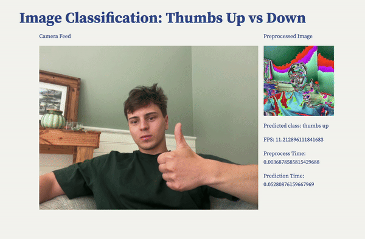
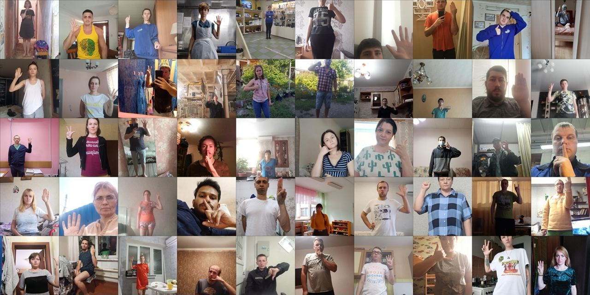

# Real Time Image Classifier: Thumbs up vs down

Written in pure python, this repository was used to [train](https://github.com/BrianLesko/fast-binary-image-classification/blob/main/train.py) and [deploy](https://github.com/BrianLesko/fast-binary-image-classification/blob/main/deploy.py) a binary image classifier engineered to distinguish between "thumbs up" and "thumbs down" hand gestures.

The model achieves 95% accuracy on a test set of 2,500 images, with training completed in just over 26 minutes. The project includes three main Python scripts: train.py, simple_test.py, and test.py, each written concisely - taking advantage of the power of Python in building complex machine learning (ML) models, quickly.

Leveraging the VGG16 convolutional neural network with pretrained weights, the model boasts rapid training capabilities, suited for deployment on personal computers for custom use cases. This model debuted in [Very Deep Convolutional Networks for Large-Scale Image Recognition](https://arxiv.org/abs/1409.1556) in 2014. Newer models are more compute efficient; therefor, this repository is not suited to large scale deployment and is better used as a learning resourse or local deployment - where it is capable of competent accuracy (95% test accuracy in this demonstration) at the tradeoff of inflated compute cost. 

&nbsp;

<div align="center"></div>

&nbsp;

## Training Summary

The model was engineered using a dataset of 2,500 images divided into two categories: "like" and "dislike". The training was executed over seven epochs and took 26.15 minutes, achieving a final test accuracy of 95.28%. The accuracy increased logarithmically, while the loss decreased from 0.7721 to 0.1551 across epochs. 

This dataset was sourced from the "like" and "dislike" classes of the Hagrid hand gesture dataset. Model weights are stored in model.pth.

If you plan to train your own model, ensure to download and organize your dataset similarly.

The model weights for the thumbs up and down implementation are saved in model.pth.

## Dataset useage

The classifier was trained to recognize hand gestures performed between 0.5 and 4 meters from the camera. The dataset, consisting of 2,500 images, was sampled from the "like" and "dislike" classes of the [Hagrid Dataset](https://github.com/hukenovs/hagrid).

<div align="center"></div>

## Simple Validation

The simple_test.py script conducts random image classifications to validate the trained model, which consistently achieved an accuracy rate above 80% across 20 separate runs.

## Deployment

The repository includes a web app that integrates with either a laptop webcam or USB camera device. On an M3 MacBook, the classifier operates at approximately 12 classifications per second, with the entire deployment script engineered in fewer than 100 lines of Python code.

To run the deployment code, follow the usage instructions below.

## Usage

To deploy the machine learning model locally, execute the following commands:

```
python3 -m venv my_env  
source my_env/bin/activate # or on windows: source my_env\Scripts\activate  
pip install -r requirements.txt  
streamlit run test.py 8000
```

to stop the app, go back to the terminal and press control C

This will start the local Streamlit server, and you can access the chatbot by opening a web browser and navigating to `http://localhost:8000`.

&nbsp;

## Dependencies

`streamlit` - for the web interface  
`pytorch` - to download the Machine learning model and run it, torch and torchvision  
`opencv` - to fetch the camera feed from your device  
`pillow` - python image library for converting from opencv to torchvision format  
`numpy` - for numerical arrays  
`scikit-learn` - to split the training and testing images  

## Transfer learning

To take advantage of transfer learning, a popular method machine learning tool, the last few layers of a pretrained neural network are modified. This allows a neural network trained for one purpose to be reused on another machine learning task. This cuts down the training time signifcatly. 

All that needs to be done is to form the output matrix into the shape appropriate for your ML task, and finetune the weights in your classifer layers.

In this case, the classifier portion of the VGG-16 convolutional neural network was modified in python using the pytorch machine learning library. 
```
# Updating the classifier with the correct input size
input_features = model.classifier[0].in_features
model.classifier = nn.Sequential(
    nn.Linear(input_features, 256),
    nn.ReLU(),
    nn.Dropout(p=0.6),
    nn.Linear(256, 1),
    nn.Sigmoid()
)
```

ReLU: Adds non-linearity, helping the model learn complex patterns.  
Dropout (60%): Minimizes overfitting during neural network training.  
Sigmoid: Ensures output values are between 0 and 1, perfect for engineering binary classification.  

## Motivation

This project is intended as a review of machine learning and AI concepts, while expanding on my software engineering skills in web app deployment that I have developed since I received my masters in Engineering from Ohio State University. 

Next, I intend to use transfer learning and the softmax for a multi-class classification neural network and integrate additional functionality into the deployed machine learning model and user interface.

If you find this project useful, please consider giving it a :star:

<hr>

&nbsp;

<div align="center">


╭━━╮╭━━━┳━━┳━━━┳━╮╱╭╮        ╭╮╱╱╭━━━┳━━━┳╮╭━┳━━━╮
┃╭╮┃┃╭━╮┣┫┣┫╭━╮┃┃╰╮┃┃        ┃┃╱╱┃╭━━┫╭━╮┃┃┃╭┫╭━╮┃
┃╰╯╰┫╰━╯┃┃┃┃┃╱┃┃╭╮╰╯┃        ┃┃╱╱┃╰━━┫╰━━┫╰╯╯┃┃╱┃┃
┃╭━╮┃╭╮╭╯┃┃┃╰━╯┃┃╰╮┃┃        ┃┃╱╭┫╭━━┻━━╮┃╭╮┃┃┃╱┃┃
┃╰━╯┃┃┃╰┳┫┣┫╭━╮┃┃╱┃┃┃        ┃╰━╯┃╰━━┫╰━╯┃┃┃╰┫╰━╯┃
╰━━━┻╯╰━┻━━┻╯╱╰┻╯╱╰━╯        ╰━━━┻━━━┻━━━┻╯╰━┻━━━╯
  


&nbsp;


<a href="https://x.com/TheBrianLesko/status/1124018912268554240"></a> &nbsp; &nbsp; &nbsp; &nbsp; &nbsp; &nbsp; <a href="https://github.com/BrianLesko"></a> &nbsp; &nbsp; &nbsp; &nbsp; &nbsp; &nbsp; <a href="https://www.linkedin.com/in/brianlesko/"></a>

follow all of these for a cookie :)

</div>


&nbsp;
